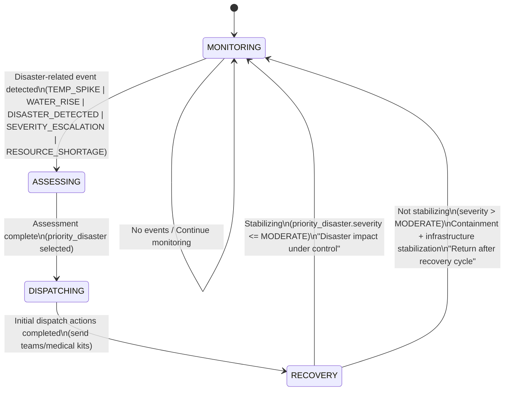

# DCIT 403 - Designing Intelligent Agent

## Disaster Response & Relief Coordination System

A multi-agent system for coordinating disaster response operations using the SPADE (Smart Python Agent Development Environment) framework.

---

## 📋 Table of Contents

- [Overview](#overview)
- [Project Structure](#project-structure)
- [Prerequisites](#prerequisites)
- [Installation](#installation)
- [Laboratory Sessions](#laboratory-sessions)
- [Usage](#usage)
- [Agent Types](#agent-types)
- [Contributing](#contributing)
- [License](#license)

---

## 🎯 Overview

This project implements a decentralized intelligent multi-agent system for disaster response coordination. The system demonstrates:

- **Agent-oriented design principles**
- **Belief-Desire-Intention (BDI) reasoning**
- **Prometheus methodology**
- **Finite State Machine (FSM) reactive behavior**
- **Goal-driven agent architectures**
- **Event derivation and processing**
- **Distributed decision-making under uncertainty**

### Core Capabilities

- ✅ Disaster event detection and classification
- ✅ Environmental perception and monitoring
- ✅ Damage severity assessment
- ✅ Goal-driven reactive behavior (FSM)
- ✅ State-based decision making
- ✅ Event-triggered responses
- ✅ Resource allocation planning
- ✅ FIPA-ACL inter-agent communication
- ✅ Message routing and conversation management
- ⬜ Multi-agent task coordination (Coming in Lab 5)

---

## 📁 Project Structure

```
dcit403-labs/
├── README.md
├── .gitignore
├── environment.py                        # Disaster environment simulator
├── register_agents.sh                    # Agent registration script (Linux/Mac)
├── lab1_basic_agent.py                   # Lab 1: Basic SPADE agent
├── lab2_sensor_agent.py                  # Lab 2: Perception (SPADE version)
├── lab_3_goal_event_fsm_agent.py         # Lab 3: FSM (standard version)
├── lab_3_goal_event_fsm_agent_spade.py   # Lab 3: FSM (SPADE version)
├── lab_4_fipa_acl_communication.py       # Lab 4: ACL (standard version)
├── lab_4_fipa_acl_communication_spade.py # Lab 4: ACL (SPADE version)
├── logs/                                 # Execution logs
│   ├── LAB2_sensor_logs.txt
│   ├── LAB3_execution_logs.txt
│   ├── LAB3_execution_logs_spade.txt
│   ├── LAB4_communication_logs.txt
│   └── LAB4_communication_logs_spade.txt
├── screenshots/                          # Lab screenshots
│   ├── lab1_screenshot.png
│   ├── lab2_screenshot.png
│   ├── lab3_screenshot.png
│   └── lab4_screenshot.png
└── reports/                              # Lab reports
    └── DCIT403_Lab_Reports.docx
```

---

## 🔧 Prerequisites

### Required Software

- **Python**: 3.9 or higher
- **pip**: Latest version
- **Git**: For version control
- **XMPP Server**: Prosody or access to public XMPP server

### Recommended Tools

- **VS Code** or **PyCharm**: IDE
- **GitHub Codespaces**: Online development environment
- **Draw.io**: For AUML diagrams

---

## 🚀 Installation

### 1. Clone the Repository

```bash
git clone https://github.com/theniitettey/dcit403_labs
cd dcit403_labs
```

### 2. Create Virtual Environment

```bash
# Create virtual environment
python3 -m venv agent_env

# Activate virtual environment
source agent_env/bin/activate  # Linux/Mac
# OR
agent_env\Scripts\activate      # Windows
```

### 3. Install Dependencies

```bash
# Upgrade pip
pip install --upgrade pip

# Install SPADE and dependencies
pip install spade
```

---

## ⚡ Quick Start (Docker + SPADE)

**For users with Docker:**

```bash
# 1. Start Prosody XMPP server
docker run -d --name prosody \
  -p 5222:5222 \
  -p 5269:5269 \
  prosody/prosody:latest

# 2. Register all agents (automated script)
# Linux/Mac:
chmod +x register_agents.sh
./register_agents.sh docker

# Windows:
register_agents.bat docker

# 3. Run any lab
python lab2_sensor_agent.py
python lab_3_goal_event_fsm_agent_spade.py
python lab_4_fipa_acl_communication_spade.py
```

**That's it!** Your XMPP server is running and all agents are registered.

---

### 4. Set Up XMPP Server

**IMPORTANT**: Labs 2-4 have both **standard versions** (simplified, no XMPP) and **SPADE versions** (framework-compliant with XMPP messaging). Choose based on your setup.

#### Option A: Local Prosody Server (Recommended for Development)

**Method 1: Docker (Recommended - Cross-platform)**

**Run Prosody with Docker:**

```bash
# Pull and run Prosody container
docker run -d --name prosody \
  -p 5222:5222 \
  -p 5269:5269 \
  -e PROSODY_ADMINS=admin@localhost \
  prosody/prosody:latest

# Verify it's running
docker ps | grep prosody

# Check logs
docker logs prosody
```

**Register All Agent Accounts:**

```bash
# For Lab 1
docker exec prosody prosodyctl register basic_agent localhost 1234

# For Lab 2
docker exec prosody prosodyctl register sensor localhost sensor123

# For Lab 3
docker exec prosody prosodyctl register response_agent localhost response123

# For Lab 4 (requires 3 accounts)
docker exec prosody prosodyctl register sensor_comm localhost lab4pass
docker exec prosody prosodyctl register response_comm localhost lab4pass
docker exec prosody prosodyctl register coordinator_comm localhost lab4pass
```

**Verify Accounts:**

```bash
# List all registered users
docker exec prosody prosodyctl list localhost

# Check specific user
docker exec prosody prosodyctl check sensor@localhost
```

**Manage Prosody Container:**

```bash
# Stop Prosody
docker stop prosody

# Start Prosody (if stopped)
docker start prosody

# Restart Prosody
docker restart prosody

# Remove Prosody (if you want to start fresh)
docker stop prosody && docker rm prosody
```

**Quick Setup Script (All Labs):**

```bash
#!/bin/bash
# Register all agents for DCIT 403 labs

echo "Registering agents for Lab 1..."
docker exec prosody prosodyctl register basic_agent localhost 1234

echo "Registering agents for Lab 2..."
docker exec prosody prosodyctl register sensor localhost sensor123

echo "Registering agents for Lab 3..."
docker exec prosody prosodyctl register response_agent localhost response123

echo "Registering agents for Lab 4..."
docker exec prosody prosodyctl register sensor_comm localhost lab4pass
docker exec prosody prosodyctl register response_comm localhost lab4pass
docker exec prosody prosodyctl register coordinator_comm localhost lab4pass

echo "✓ All agents registered successfully!"
docker exec prosody prosodyctl list localhost
```

**Method 2: Native Installation**

**Install Prosody:**

```bash
# Ubuntu/Debian
sudo apt-get update
sudo apt-get install prosody

# macOS
brew install prosody

# Windows
# Download from: https://prosody.im/download/start
```

**Configure Prosody:**

```bash
# Edit /etc/prosody/prosody.cfg.lua
# Ensure these settings:
admins = { }
modules_enabled = {
    "roster";
    "saslauth";
    "tls";
    "dialback";
    "disco";
}
allow_registration = true  # Allow in-band registration
```

**Start Prosody:**

```bash
sudo prosodyctl start

# Verify it's running
sudo prosodyctl status
```

**Create Agent Accounts (Native):**

```bash
# For Lab 1
sudo prosodyctl register basic_agent localhost 1234

# For Lab 2
sudo prosodyctl register sensor localhost sensor123

# For Lab 3
sudo prosodyctl register response_agent localhost response123

# For Lab 4 (requires 3 accounts)
sudo prosodyctl register sensor_comm localhost lab4pass
sudo prosodyctl register response_comm localhost lab4pass
sudo prosodyctl register coordinator_comm localhost lab4pass
```

#### Option B: Public XMPP Server (No Installation Required)

**Recommended Public Servers:**

- **xmpp.jp** - https://xmpp.jp/ (Japanese, stable)
- **jabber.org** - Classic XMPP server
- **404.city** - Modern, reliable

**Register Accounts:**

1. Use an XMPP client like Gajim, Conversations, or Psi
2. Create accounts for each agent
3. Update the JID in lab files (e.g., `sensor@xmpp.jp`)

**Update Code for Remote Server:**

```python
# In each lab file, change:
XMPP_SERVER = "localhost"  # to
XMPP_SERVER = "xmpp.jp"    # or your chosen server
```

#### Option C: No XMPP (Simplified Versions)

Use the standard lab files (without `_spade` suffix) which implement agent concepts without requiring XMPP infrastructure.

---

## 📂 Lab Versions

Each lab (2-4) has two versions:

| Version      | File Pattern       | Requires XMPP | Use Case                               |
| ------------ | ------------------ | ------------- | -------------------------------------- |
| **Standard** | `lab_X_*.py`       | ❌ No         | Quick testing, concept learning        |
| **SPADE**    | `lab_X_*_spade.py` | ✅ Yes        | Framework-compliant, course submission |

**Examples:**

- `lab2_sensor_agent.py` - Standard version
- `lab2_sensor_agent.py` - Already uses SPADE (updated)
- `lab_3_goal_event_fsm_agent_spade.py` - SPADE version with FSM
- `lab_4_fipa_acl_communication_spade.py` - SPADE version with messaging

---

## 🧪 Laboratory Sessions

### Progress Overview

| Lab      | Title                                | Status         | Key Concepts                             |
| -------- | ------------------------------------ | -------------- | ---------------------------------------- |
| Lab 1    | Environment and Agent Platform Setup | ✅ Complete    | SPADE, Agent lifecycle, XMPP             |
| Lab 2    | Perception and Environment Modeling  | ✅ Complete    | Percepts, Sensors, Event detection       |
| Lab 3    | Goals, Events, and Reactive Behavior | ✅ Complete    | FSM, Goals, State transitions            |
| Lab 4    | Agent Communication Using FIPA-ACL   | ✅ Complete    | ACL, Performatives, Protocols, Messaging |
| Lab 5    | Coordination and Task Delegation     | 🔄 Coming Soon | Task allocation, Coordination            |
| Lab 6-13 | Advanced Topics                      | 🔄 Future      | Prometheus, BDI, System integration      |

---

### Lab 1: Environment and Agent Platform Setup

**Objective**: Configure Python environment and deploy basic SPADE agent

**Tasks**:

1. Verify Python and SPADE installation
2. Start XMPP server
3. Create and run basic agent
4. Demonstrate agent lifecycle

**Run**:

```bash
python lab1_basic_agent.py
```

**Expected Output**:

- Agent initialization
- Connection to XMPP server
- 5 behavior cycles
- Graceful shutdown

---

### Lab 2: Perception and Environment Modeling

**Objective**: Implement agent perception and disaster event detection

**Key Concepts**:

- Environmental percepts
- Sensor data processing
- Event detection and classification
- Severity assessment

**Tasks**:

1. Create disaster environment simulator (`environment.py`)
2. Implement SensorAgent with perception capabilities
3. Monitor environmental conditions across multiple zones
4. Detect and classify disaster events
5. Log events with severity levels

**Run**:

```bash
python lab2_sensor_agent.py
```

**Expected Output**:

- Environmental monitoring across 4 zones (Accra, Kumasi, Takoradi, Tamale)
- Temperature, humidity, water level, visibility readings
- Real-time disaster event detection
- Severity classification (LOW, MODERATE, SEVERE, CRITICAL)
- Affected population estimates

**Key Classes**:

- `DisasterEnvironment`: Simulates environmental conditions
- `Location`: Represents geographical zones
- `DisasterEvent`: Models disaster occurrences
- `EnvironmentPercept`: Sensor readings
- `SensorAgent`: Autonomous monitoring agent

---

### Lab 3: Goals, Events, and Reactive Behavior

**Objective**: Model agent goals and implement event-triggered reactive behavior using Finite State Machines

**Key Concepts**:

- Goal-driven agent architecture
- Event derivation from percepts
- Finite State Machine (FSM) for reactive behavior
- State transitions based on events
- Goal alignment with actions

**Tasks**:

1. Define rescue and response goals
2. Implement event derivation from environmental percepts
3. Design FSM with four states: MONITORING, ASSESSING, DISPATCHING, RECOVERY
4. Implement reactive behavior rules for state transitions
5. Prioritize disasters based on severity and impact
6. Generate execution trace logs

**Run**:

```bash
python lab_3_goal_event_fsm_agent.py
```

**Expected Output**:

- State transitions based on disaster events
- Event-driven decision making
- Resource allocation recommendations
- Goal alignment logging
- Execution trace saved to `logs/LAB3_execution_logs.txt`

**Agent Goals**:

1. **Rescue People**: Minimize casualties through rapid rescue operations
2. **Stabilize Infrastructure**: Stabilize critical infrastructure to prevent further damage
3. **Optimize Resources**: Optimize resource allocation for maximum efficiency

**Derived Events**:

- `TEMP_SPIKE`: Temperature exceeds 42°C
- `WATER_RISE`: Water level exceeds 1.5m
- `DISASTER_DETECTED`: New disaster event identified
- `SEVERITY_ESCALATION`: Disaster severity reaches CRITICAL level
- `RESOURCE_SHORTAGE`: High resource requirements (≥12 rescue teams)

#### FSM State Diagram



**State Descriptions**:

| State           | Description                                    | Entry Conditions                   | Actions                                             |
| --------------- | ---------------------------------------------- | ---------------------------------- | --------------------------------------------------- |
| **MONITORING**  | Continuous surveillance of all zones           | Initial state or recovery complete | Periodic monitoring, no active response             |
| **ASSESSING**   | Evaluating disaster severity and impact        | Disaster-related event detected    | Analyze events, prioritize disasters                |
| **DISPATCHING** | Allocating resources and coordinating response | Assessment complete                | Deploy rescue teams, allocate medical kits          |
| **RECOVERY**    | Stabilization and infrastructure restoration   | Initial dispatch complete          | Monitor recovery progress, stabilize infrastructure |

**Key Implementation Details**:

- **Priority Algorithm**: Disasters prioritized by severity, casualties, and infrastructure damage
- **State History**: All transitions logged with timestamps and reasons
- **Trace Logging**: Comprehensive execution logs for analysis
- **Reactive Rules**: FSM policy determines state transitions based on current state and events

**Deliverables**:

- ✅ FSM implementation in Python
- ✅ State transition logic
- ✅ Event derivation from percepts
- ✅ Execution trace file (`logs/LAB3_execution_logs.txt`)
- ✅ Goal alignment documentation

---

### Lab 4: Agent Communication Using FIPA-ACL

**Objective**: Implement inter-agent communication using the Foundation for Intelligent Physical Agents - Agent Communication Language (FIPA-ACL) standard

**Key Concepts**:

- FIPA-ACL message structure and performatives
- Inter-agent communication protocols
- Message routing and delivery
- Request-response interaction patterns
- Conversation management
- Ontology-based communication

**Tasks**:

1. Implement ACL message structure with FIPA-compliant fields
2. Create SensorCommunicatorAgent that sends INFORM messages
3. Implement ResponseAgent that receives and processes messages
4. Create CoordinatorAgent that handles resource allocation requests
5. Implement message routing system between agents
6. Use multiple performatives: INFORM, REQUEST, AGREE, REFUSE, CONFIRM
7. Track conversations and generate communication logs

**Run**:

```bash
python lab_4_fipa_acl_communication.py
```

**Expected Output**:

- Multi-agent message exchange simulation
- FIPA-ACL compliant messages with proper structure
- Request-response protocols for resource allocation
- Conversation tracking across multiple messages
- Detailed communication logs saved to `logs/LAB4_communication_logs.txt`

**FIPA-ACL Performatives Used**:

| Performative | Description                                | Used By          | Purpose                                                  |
| ------------ | ------------------------------------------ | ---------------- | -------------------------------------------------------- |
| **INFORM**   | Inform another agent of a fact             | SensorAgent      | Notify about detected disasters and environmental status |
| **REQUEST**  | Request another agent to perform an action | ResponseAgent    | Request resource allocation from coordinator             |
| **AGREE**    | Agree to perform the requested action      | CoordinatorAgent | Confirm acceptance of resource allocation request        |
| **REFUSE**   | Refuse to perform the requested action     | CoordinatorAgent | Decline request due to insufficient resources            |
| **CONFIRM**  | Confirm the truth of a proposition         | CoordinatorAgent | Confirm successful resource allocation                   |
| **QUERY-IF** | Ask if a proposition is true               | ResponseAgent    | Query resource availability (future use)                 |

#### ACL Message Structure

Each FIPA-ACL message contains the following fields:

```python
{
    "performative": "inform",           # Message type (INFORM, REQUEST, etc.)
    "sender": "SENSOR-001",             # Agent ID of sender
    "receiver": "RESPONSE-AGENT-001",   # Agent ID of receiver
    "content": {                        # Message payload (domain-specific)
        "message_type": "disaster_detected",
        "location": "Kumasi",
        "disaster_type": "fire",
        "severity": "SEVERE",
        ...
    },
    "conversation_id": "CONV-SENSOR-001-1",  # Unique conversation identifier
    "reply_to": "CONV-SENSOR-001-1",          # Reference to previous message
    "language": "JSON",                       # Content language
    "ontology": "disaster-response",          # Domain ontology
    "protocol": "disaster-alert",             # Interaction protocol
    "timestamp": "2026-02-21T14:30:45"        # ISO timestamp
}
```

#### Communication Protocols

| Protocol                     | Purpose                        | Message Flow                                                         |
| ---------------------------- | ------------------------------ | -------------------------------------------------------------------- |
| **disaster-alert**           | Notify about disaster events   | Sensor → Response (INFORM)                                           |
| **resource-allocation**      | Request and allocate resources | Response → Coordinator (REQUEST) → Response (AGREE/REFUSE + CONFIRM) |
| **environmental-monitoring** | Share environmental status     | Sensor → Response (INFORM)                                           |
| **fipa-request**             | Standard FIPA request protocol | Any agent (REQUEST → AGREE/REFUSE)                                   |

#### Agent Communication Architecture

```
┌─────────────────┐
│  SensorAgent    │
│   (SENSOR-001)  │
└────────┬────────┘
         │ INFORM (disaster_detected)
         │ INFORM (environmental_status)
         ▼
┌─────────────────┐
│ ResponseAgent   │
│(RESPONSE-001)   │
└────────┬────────┘
         │ REQUEST (allocate_resources)
         ▼
┌─────────────────┐      ┌──────────────────────────┐
│CoordinatorAgent │──────│ AGREE (resources_allocated) │
│(COORDINATOR-001)│      │ or                         │
└─────────────────┘      │ REFUSE (insufficient)      │
         │               │ + CONFIRM (allocation)     │
         └───────────────┴──────────────────────────┘
```

#### Message Exchange Sequence

**Scenario**: Fire detected in Kumasi, resources requested and allocated

```
1. SENSOR-001 → RESPONSE-AGENT-001
   Performative: INFORM
   Content: Disaster detected (fire, SEVERE, Kumasi)
   Conversation: CONV-SENSOR-001-1

2. RESPONSE-AGENT-001 → COORDINATOR-001
   Performative: REQUEST
   Content: Allocate resources (rescue_teams: 2, medical_kits: 38)
   Conversation: CONV-SENSOR-001-1
   Reply-To: CONV-SENSOR-001-1

3. COORDINATOR-001 → RESPONSE-AGENT-001
   Performative: AGREE
   Content: Resources allocated to Kumasi
   Conversation: CONV-SENSOR-001-1

4. COORDINATOR-001 → RESPONSE-AGENT-001
   Performative: CONFIRM
   Content: Allocation complete, remaining resources updated
   Conversation: CONV-SENSOR-001-1
```

#### Agent Implementations

**1. SensorCommunicatorAgent**

- **Role**: Disaster detection and notification
- **Capabilities**:
  - Detect disasters from environmental percepts
  - Send INFORM messages about detected disasters
  - Send periodic environmental status updates
  - Generate unique conversation IDs
- **Messages Sent**: INFORM

**2. ResponseAgent**

- **Role**: Disaster response coordination
- **Capabilities**:
  - Receive disaster notifications (INFORM)
  - Process disaster information
  - Request resources from CoordinatorAgent (REQUEST)
  - Handle allocation responses (AGREE/REFUSE/CONFIRM)
  - Track active disasters
- **Messages Sent**: REQUEST
- **Messages Received**: INFORM, AGREE, REFUSE, CONFIRM

**3. CoordinatorAgent**

- **Role**: Resource management and allocation
- **Capabilities**:
  - Maintain resource inventory (rescue_teams, medical_kits, fire_trucks, ambulances)
  - Process resource allocation requests
  - Check resource availability
  - Send AGREE if resources available
  - Send REFUSE if insufficient resources
  - Send CONFIRM upon successful allocation
  - Track allocated resources per disaster
- **Messages Sent**: AGREE, REFUSE, CONFIRM, INFORM
- **Messages Received**: REQUEST, QUERY-IF

**4. MultiAgentCommunicationSystem**

- **Role**: Message routing and coordination
- **Capabilities**:
  - Manage multiple agents
  - Route messages between agent inboxes/outboxes
  - Log all message exchanges
  - Generate comprehensive communication traces
  - Synchronize agent interactions

#### Key Implementation Details

- **Message Routing**: Central system routes messages from sender's outbox to receiver's inbox
- **Conversation Tracking**: Unique IDs link related messages in multi-step interactions
- **Protocol Adherence**: All messages follow FIPA-ACL standard structure
- **Asynchronous Communication**: Agents operate independently with message-based coordination
- **Resource Management**: Coordinator tracks available and allocated resources in real-time
- **Traceability**: Complete message logs with timestamps and conversation context

#### Communication Log Structure

The trace file (`logs/LAB4_communication_logs.txt`) contains:

```
LAB 4 EXECUTION TRACE - FIPA-ACL COMMUNICATION
==============================================

AGENT ARCHITECTURE
- SensorAgent: SENSOR-001
- ResponseAgent: RESPONSE-AGENT-001
- CoordinatorAgent: COORDINATOR-001

MESSAGE EXCHANGE SUMMARY
Total Messages: 12
Messages by Performative:
  INFORM: 4
  REQUEST: 2
  AGREE: 2
  CONFIRM: 2
  REFUSE: 2

DETAILED MESSAGE LOG
Message 1:
  Performative: INFORM
  Sender: SENSOR-001
  Receiver: RESPONSE-AGENT-001
  Conversation ID: CONV-SENSOR-001-1
  Protocol: disaster-alert
  Timestamp: 2026-02-21T14:30:45
  Content: {
    "message_type": "disaster_detected",
    "location": "Kumasi",
    "disaster_type": "fire",
    "severity": "SEVERE",
    ...
  }

RESOURCE ALLOCATION SUMMARY
Remaining Resources:
  rescue_teams: 16
  medical_kits: 62
  fire_trucks: 10
  ambulances: 15

Allocated to Disasters:
  Event fire-kumasi-001: {rescue_teams: 2, medical_kits: 38}
  Event flood-accra-002: {rescue_teams: 2, medical_kits: 0}
```

**Deliverables**:

- ✅ FIPA-ACL message structure implementation
- ✅ Three communicating agents (Sensor, Response, Coordinator)
- ✅ Multiple performative types (INFORM, REQUEST, AGREE, REFUSE, CONFIRM)
- ✅ Message routing system
- ✅ Conversation tracking and management
- ✅ Resource allocation protocol
- ✅ Comprehensive communication logs (`logs/LAB4_communication_logs.txt`)
- ✅ Message exchange statistics and summaries

**Learning Outcomes**:

- Understanding FIPA-ACL message structure and semantics
- Implementing agent communication protocols
- Managing conversations across multiple message exchanges
- Coordinating distributed decision-making through messages
- Handling agreement and refusal in multi-agent negotiations
- Logging and analyzing inter-agent communication patterns

---

### Lab 5: Coordination and Task Delegation (Coming Soon)

**Objective**: Coordinate multiple agents for disaster response

**Features**:

- Task allocation
- Resource sharing
- Collaborative decision-making

---

## 💻 Usage

### Lab 1: Basic Agent Example

```python
from spade.agent import Agent
from spade.behaviour import CyclicBehaviour
import asyncio

class MyAgent(Agent):
    class MyBehaviour(CyclicBehaviour):
        async def run(self):
            print(f"{self.agent.jid}: Running...")
            await asyncio.sleep(1)

    async def setup(self):
        b = self.MyBehaviour()
        self.add_behaviour(b)

# Create and start agent
agent = MyAgent("user@xmpp.jp", "password")
agent.start()
```

### Lab 2: SensorAgent Example

```python
from lab2_sensor_agent import SensorAgent, DisasterEnvironment

# Create disaster environment
environment = DisasterEnvironment()

# Create sensor agent
sensor = SensorAgent(agent_id="SENSOR-001", environment=environment)

# Start monitoring (runs for 10 cycles)
await sensor.run(cycles=10, interval_seconds=3)

# Agent will detect disasters and display sensor readings
```

### Lab 3: Goal-Reactive FSM Agent Example

```python
from lab_3_goal_event_fsm_agent import GoalReactiveResponseAgent
from environment import DisasterEnvironment
import asyncio

# Create environment
environment = DisasterEnvironment()

# Create goal-driven reactive agent
agent = GoalReactiveResponseAgent(
    agent_id="RESPONSE-001",
    environment=environment
)

# Run simulation (8 cycles, 1 second intervals)
await agent.run(cycles=8, interval_seconds=1)

# Execution trace automatically saved to logs/LAB3_execution_logs.txt
```

**Lab 3 Output Structure**:

```
[2026-02-21 13:27:42] RESPONSE-001 | Starting goal-driven reactive response agent
[2026-02-21 13:27:42] RESPONSE-001 | Initial state: MONITORING
[2026-02-21 13:27:42] RESPONSE-001 | --- CYCLE 1/8 ---
[2026-02-21 13:27:43] RESPONSE-001 | EVENT TEMP_SPIKE @ Kumasi | Temperature at 46.5°C
[2026-02-21 13:27:43] RESPONSE-001 | STATE MONITORING -> ASSESSING | Reason: Disaster-related event detected
[2026-02-21 13:27:43] RESPONSE-001 | STATE ASSESSING -> DISPATCHING | Reason: Assessment complete
[2026-02-21 13:27:43] RESPONSE-001 | Dispatch: Send 2 rescue teams and 38 medical kits to Ada
[2026-02-21 13:27:43] RESPONSE-001 | Goal Alignment: Minimize casualties through rapid rescue operations
```

### Lab 4: FIPA-ACL Communication Example

```python
from lab_4_fipa_acl_communication import MultiAgentCommunicationSystem
from environment import DisasterEnvironment
import asyncio

# Create environment
environment = DisasterEnvironment()

# Create multi-agent communication system
system = MultiAgentCommunicationSystem(environment)

# Run simulation (6 cycles, 1 second intervals)
await system.run(cycles=6, interval_seconds=1)

# Communication logs automatically saved to logs/LAB4_communication_logs.txt
```

**Lab 4 Output Structure**:

```
================================================================================
LAB 4: Agent Communication Using FIPA-ACL
Disaster Response & Relief Coordination System
================================================================================

================================================================================
CYCLE 1/6
================================================================================

[2026-02-21 14:30:45] SENSOR-001 | SEND ACL[INFORM] SENSOR-001 -> RESPONSE-AGENT-001 | Conv:CONV-SENSOR-001-1 | {'message_type': 'disaster_detected', 'location': 'Kumasi', 'disaster_type': 'fire', 'severity': 'SEVERE', ...}

[2026-02-21 14:30:45] RESPONSE-AGENT-001 | RECV ACL[INFORM] SENSOR-001 -> RESPONSE-AGENT-001 | Conv:CONV-SENSOR-001-1 | {'message_type': 'disaster_detected', ...}

[2026-02-21 14:30:45] RESPONSE-AGENT-001 | Disaster informed: fire at Kumasi (Severity: SEVERE)

[2026-02-21 14:30:45] RESPONSE-AGENT-001 | SEND ACL[REQUEST] RESPONSE-AGENT-001 -> COORDINATOR-001 | Conv:CONV-SENSOR-001-1 | {'action': 'allocate_resources', ...}

[2026-02-21 14:30:45] COORDINATOR-001 | RECV ACL[REQUEST] RESPONSE-AGENT-001 -> COORDINATOR-001 | Conv:CONV-SENSOR-001-1 | {'action': 'allocate_resources', ...}

[2026-02-21 14:30:45] COORDINATOR-001 | SEND ACL[AGREE] COORDINATOR-001 -> RESPONSE-AGENT-001 | Conv:CONV-SENSOR-001-1 | {'action': 'allocate_resources', 'resources_allocated': {'rescue_teams': 2, 'medical_kits': 38}, ...}

[2026-02-21 14:30:45] COORDINATOR-001 | SEND ACL[CONFIRM] COORDINATOR-001 -> RESPONSE-AGENT-001 | Conv:CONV-SENSOR-001-1 | {'message': 'Resources allocated to Kumasi', ...}
```

---

## 🤖 Agent Types

### 1. SensorAgent

**Responsibility**: Detect disaster events and report environmental conditions

**Capabilities**:

- Multi-zone monitoring
- Temperature/humidity sensing
- Disaster type classification
- Severity assessment (LOW, MEDIUM, HIGH, CRITICAL)

### 2. RescueAgent (Future)

**Responsibility**: Perform rescue operations

**Capabilities**:

- Task execution
- Resource utilization
- Status reporting

### 3. LogisticsAgent (Future)

**Responsibility**: Manage supplies and relief items

**Capabilities**:

- Inventory management
- Resource allocation
- Supply chain coordination

### 4. CoordinatorAgent (Lab 4)

**Responsibility**: Resource management and allocation coordination via FIPA-ACL

**Capabilities**:

- Receive and process resource allocation requests (REQUEST messages)
- Manage resource inventory (rescue teams, medical kits, fire trucks, ambulances)
- Send AGREE messages when resources are available
- Send REFUSE messages when resources are insufficient
- Send CONFIRM messages upon successful allocation
- Track allocated resources per disaster event
- Respond to QUERY-IF messages about resource availability

### 5. ResponseAgent (Lab 4)

**Responsibility**: Disaster response coordination and communication

**Capabilities**:

- Receive disaster notifications (INFORM messages from SensorAgent)
- Process disaster information and assess needs
- Send resource allocation requests to CoordinatorAgent (REQUEST messages)
- Handle allocation responses (AGREE/REFUSE/CONFIRM)
- Track active disasters and their status
- Coordinate response actions based on communication

### 6. RescueAgent (Future)

**Responsibility**: Execute rescue operations

**Capabilities**:

- Task execution
- Resource utilization
- Status reporting

---

## 📊 Logging and Traceability

### Lab 2: Sensor Readings

Environmental data and sensor percepts are displayed in real-time with the following information:

- Zone/Location
- Temperature (°C)
- Humidity (%)
- Water Level (m)
- Visibility (m)
- Active disasters with severity

### Lab 3: Execution Trace

Complete FSM execution traces are saved to `logs/LAB3_execution_logs.txt` with:

**Trace File Structure**:

```
LAB 3 EXECUTION TRACE
======================
Agent: RESPONSE-001
Generated: 2026-02-21T13:27:50

GOALS
- Minimize casualties through rapid rescue operations
- Stabilize critical infrastructure to prevent further damage
- Optimize resource allocation for maximum efficiency

TRANSITIONS
[2026-02-21 13:27:43] MONITORING -> ASSESSING | Disaster-related event detected
[2026-02-21 13:27:43] ASSESSING -> DISPATCHING | Assessment complete
[2026-02-21 13:27:43] DISPATCHING -> RECOVERY | Initial dispatch actions completed
[2026-02-21 13:27:45] RECOVERY -> MONITORING | Return to monitor after recovery cycle

TRACE LOG
------------------------------------------------------------------------------------------
[2026-02-21 13:27:42] RESPONSE-001 | Starting goal-driven reactive response agent
[2026-02-21 13:27:42] RESPONSE-001 | Initial state: MONITORING
[2026-02-21 13:27:42] RESPONSE-001 | --- CYCLE 1/8 ---
[2026-02-21 13:27:43] RESPONSE-001 | EVENT TEMP_SPIKE @ Kumasi | Temperature at 46.5°C
[2026-02-21 13:27:43] RESPONSE-001 | STATE MONITORING -> ASSESSING | Reason: Disaster-related event detected
```

---

## 🔍 Testing

### Run Individual Labs

**Standard Versions (No XMPP Required):**

```bash
# Activate virtual environment first
source agent_env/bin/activate  # Linux/Mac
# OR
agent_env\Scripts\activate      # Windows

# Lab 1: Basic agent setup (requires XMPP)
python lab1_basic_agent.py

# Lab 2: Sensor agent with perception (SPADE version)
python lab2_sensor_agent.py

# Lab 3: Goal-driven FSM agent (standard - no XMPP)
python lab_3_goal_event_fsm_agent.py

# Lab 4: FIPA-ACL communication (standard - no XMPP)
python lab_4_fipa_acl_communication.py
```

**SPADE Versions (Requires XMPP Server):**

```bash
# Ensure Prosody is running (if using local server)
sudo prosodyctl status

# Lab 2: Already uses SPADE
python lab2_sensor_agent.py

# Lab 3: Goal-driven FSM agent (SPADE version)
python lab_3_goal_event_fsm_agent_spade.py

# Lab 4: FIPA-ACL communication (SPADE version with real messaging)
python lab_4_fipa_acl_communication_spade.py
```

### Check Outputs

```bash
# View Lab 3 execution trace
cat logs/LAB3_execution_logs.txt

# View Lab 4 communication logs
cat logs/LAB4_communication_logs.txt

# Or on Windows
type logs\LAB3_execution_logs.txt
type logs\LAB4_communication_logs.txt
```

### Verify Installation

```bash
python -c "import spade; print('SPADE version:', spade.__version__)"
python -c "from environment import DisasterEnvironment; print('Environment module: OK')"
```

---

## 🛠️ Troubleshooting

### SPADE Installation Issues

```bash
# Try upgrading pip first
pip install --upgrade pip

# Install with verbose output
pip install -v spade
```

### XMPP Connection Failed

- Check your internet connection
- Verify XMPP credentials
- Try alternative server (xmpp.jp, jabber.org)
- Check firewall settings

### Virtual Environment Issues

```bash
# Delete and recreate
rm -rf agent_env
python3 -m venv agent_env
source agent_env/bin/activate
pip install spade
```

---

## 📚 Resources

### Documentation

- [SPADE Documentation](https://spade-mas.readthedocs.io/)
- [FIPA Standards](http://www.fipa.org/repository/standardspecs.html)
- [Prometheus Methodology](http://www.cs.rmit.edu.au/agents/prometheus/)

### Tutorials

- [Python Virtual Environments](https://docs.python.org/3/tutorial/venv.html)
- [XMPP Protocol](https://xmpp.org/about/technology-overview/)
- [Multi-Agent Systems](https://en.wikipedia.org/wiki/Multi-agent_system)

---

## 🤝 Contributing

This is an educational project for DCIT 403. Contributions are welcome!

### Development Workflow

1. Fork the repository
2. Create feature branch (`git checkout -b feature/lab3`)
3. Commit changes (`git commit -m 'Add Lab 3 implementation'`)
4. Push to branch (`git push origin feature/lab3`)
5. Open Pull Request

---

## 📅 Version History

- **v0.4.1** (2026-02-21): SPADE Framework Integration
  - Refactored Lab 2 to properly use SPADE with PeriodicBehaviour
  - Created SPADE version of Lab 3 with FSMBehaviour
  - Created SPADE version of Lab 4 with real XMPP messaging
  - Added comprehensive XMPP server setup guide (local and remote)
  - Documented dual versions for each lab (standard vs SPADE)
  - Updated project structure with all file variants
- **v0.4.0** (2026-02-21): Lab 4 - FIPA-ACL Agent Communication
  - Implemented FIPA-ACL compliant message structure
  - Created three communicating agents (Sensor, Response, Coordinator)
  - Added multiple performatives (INFORM, REQUEST, AGREE, REFUSE, CONFIRM)
  - Implemented message routing and conversation management
  - Resource allocation protocol with agreement/refusal handling
  - Communication logs with message exchange statistics
- **v0.3.0** (2026-02-21): Lab 3 - Goals, Events, and FSM Reactive Behavior
  - Implemented goal-driven agent architecture
  - Added FSM with 4 states (MONITORING, ASSESSING, DISPATCHING, RECOVERY)
  - Event derivation from environmental percepts
  - State transition logging and traceability
  - Execution trace file generation
- **v0.2.0** (2026-01-28): Lab 2 - Perception and Environment Modeling
  - SensorAgent implementation
  - DisasterEnvironment simulator
  - Multi-zone monitoring capabilities
- **v0.1.0** (2026-01-28): Lab 1 - Basic Agent Setup
  - Python environment configuration
  - Basic SPADE agent lifecycle
- **v0.0.1** (2026-01-27): Initial project structure

---

**Last Updated**: February 21, 2026
