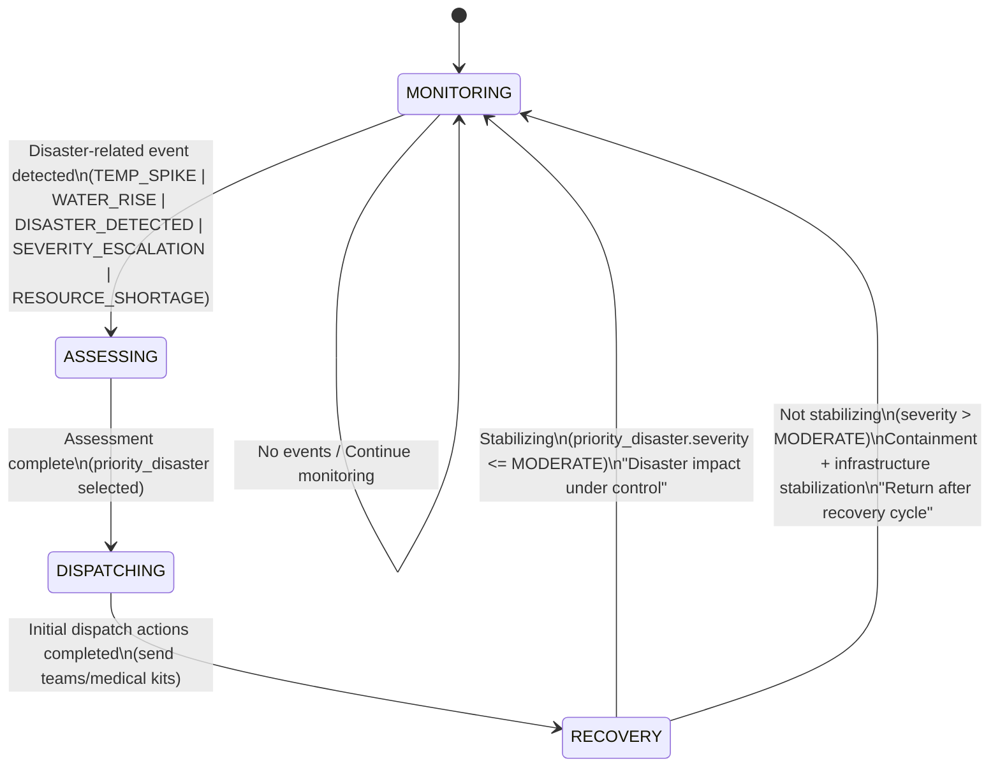

# DCIT 403 - Designing Intelligent Agent

## Disaster Response & Relief Coordination System

A multi-agent system for coordinating disaster response operations using the SPADE (Smart Python Agent Development Environment) framework.

---

## 📋 Table of Contents

- [Overview](#overview)
- [Project Structure](#project-structure)
- [Prerequisites](#prerequisites)
- [Installation](#installation)
- [Laboratory Sessions](#laboratory-sessions)
- [Usage](#usage)
- [Agent Types](#agent-types)
- [Contributing](#contributing)
- [License](#license)

---

## 🎯 Overview

This project implements a decentralized intelligent multi-agent system for disaster response coordination. The system demonstrates:

- **Agent-oriented design principles**
- **Belief-Desire-Intention (BDI) reasoning**
- **Prometheus methodology**
- **Finite State Machine (FSM) reactive behavior**
- **Goal-driven agent architectures**
- **Event derivation and processing**
- **Distributed decision-making under uncertainty**

### Core Capabilities

- ✅ Disaster event detection and classification
- ✅ Environmental perception and monitoring
- ✅ Damage severity assessment
- ✅ Goal-driven reactive behavior (FSM)
- ✅ State-based decision making
- ✅ Event-triggered responses
- ✅ Resource allocation planning
- ⬜ Multi-agent coordination (Coming in Lab 4-5)
- ⬜ FIPA-ACL communication (Coming in Lab 4)

---

## 📁 Project Structure

```
dcit403-labs/
├── README.md
├── .gitignore
├── environment.py                # Disaster environment simulator
├── agent_env/                    # Virtual environment (not tracked)
├── lab1_basic_agent.py           # Lab 1: Basic agent setup
├── lab2_sensor_agent.py          # Lab 2: Perception and environment modeling
├── lab_3_goal_event_fsm_agent.py # Lab 3: Goals, events, and FSM behavior
├── logs/                         # Execution logs
│   └── LAB3_execution_logs.txt
├── screenshots/                  # Lab screenshots
│   ├── lab1_screenshot.png
│   ├── lab2_screenshot.png
│   └── lab3_screenshot.png
```

---

## 🔧 Prerequisites

### Required Software

- **Python**: 3.9 or higher
- **pip**: Latest version
- **Git**: For version control
- **XMPP Server**: Prosody or access to public XMPP server

### Recommended Tools

- **VS Code** or **PyCharm**: IDE
- **GitHub Codespaces**: Online development environment
- **Draw.io**: For AUML diagrams

---

## 🚀 Installation

### 1. Clone the Repository

```bash
git clone https://github.com/theniitettey/dcit403_labs
cd dcit403_labs
```

### 2. Create Virtual Environment

```bash
# Create virtual environment
python3 -m venv agent_env

# Activate virtual environment
source agent_env/bin/activate  # Linux/Mac
# OR
agent_env\Scripts\activate      # Windows
```

### 3. Install Dependencies

```bash
# Upgrade pip
pip install --upgrade pip

# Install SPADE and dependencies
pip install spade
```

### 4. Set Up XMPP Account

**Option A: Public Server (Recommended for Testing)**

- Register at: https://xmpp.jp/
- Use credentials in your agent code

**Option B: Local Prosody Server**

```bash
sudo apt-get update
sudo apt-get install prosody

# Create agent account
sudo prosodyctl adduser disaster_agent@localhost
```

---

## 🧪 Laboratory Sessions

### Progress Overview

| Lab      | Title                                | Status         | Key Concepts                        |
| -------- | ------------------------------------ | -------------- | ----------------------------------- |
| Lab 1    | Environment and Agent Platform Setup | ✅ Complete    | SPADE, Agent lifecycle, XMPP        |
| Lab 2    | Perception and Environment Modeling  | ✅ Complete    | Percepts, Sensors, Event detection  |
| Lab 3    | Goals, Events, and Reactive Behavior | ✅ Complete    | FSM, Goals, State transitions       |
| Lab 4    | Agent Communication Using FIPA-ACL   | 🔄 Coming Soon | ACL, Performatives, Protocols       |
| Lab 5    | Coordination and Task Delegation     | 🔄 Coming Soon | Task allocation, Coordination       |
| Lab 6-13 | Advanced Topics                      | 🔄 Future      | Prometheus, BDI, System integration |

---

### Lab 1: Environment and Agent Platform Setup

**Objective**: Configure Python environment and deploy basic SPADE agent

**Tasks**:

1. Verify Python and SPADE installation
2. Start XMPP server
3. Create and run basic agent
4. Demonstrate agent lifecycle

**Run**:

```bash
python lab1_basic_agent.py
```

**Expected Output**:

- Agent initialization
- Connection to XMPP server
- 5 behavior cycles
- Graceful shutdown

---

### Lab 2: Perception and Environment Modeling

**Objective**: Implement agent perception and disaster event detection

**Key Concepts**:

- Environmental percepts
- Sensor data processing
- Event detection and classification
- Severity assessment

**Tasks**:

1. Create disaster environment simulator (`environment.py`)
2. Implement SensorAgent with perception capabilities
3. Monitor environmental conditions across multiple zones
4. Detect and classify disaster events
5. Log events with severity levels

**Run**:

```bash
python lab2_sensor_agent.py
```

**Expected Output**:

- Environmental monitoring across 4 zones (Accra, Kumasi, Takoradi, Tamale)
- Temperature, humidity, water level, visibility readings
- Real-time disaster event detection
- Severity classification (LOW, MODERATE, SEVERE, CRITICAL)
- Affected population estimates

**Key Classes**:

- `DisasterEnvironment`: Simulates environmental conditions
- `Location`: Represents geographical zones
- `DisasterEvent`: Models disaster occurrences
- `EnvironmentPercept`: Sensor readings
- `SensorAgent`: Autonomous monitoring agent

---

### Lab 3: Goals, Events, and Reactive Behavior

**Objective**: Model agent goals and implement event-triggered reactive behavior using Finite State Machines

**Key Concepts**:

- Goal-driven agent architecture
- Event derivation from percepts
- Finite State Machine (FSM) for reactive behavior
- State transitions based on events
- Goal alignment with actions

**Tasks**:

1. Define rescue and response goals
2. Implement event derivation from environmental percepts
3. Design FSM with four states: MONITORING, ASSESSING, DISPATCHING, RECOVERY
4. Implement reactive behavior rules for state transitions
5. Prioritize disasters based on severity and impact
6. Generate execution trace logs

**Run**:

```bash
python lab_3_goal_event_fsm_agent.py
```

**Expected Output**:

- State transitions based on disaster events
- Event-driven decision making
- Resource allocation recommendations
- Goal alignment logging
- Execution trace saved to `logs/LAB3_execution_logs.txt`

**Agent Goals**:

1. **Rescue People**: Minimize casualties through rapid rescue operations
2. **Stabilize Infrastructure**: Stabilize critical infrastructure to prevent further damage
3. **Optimize Resources**: Optimize resource allocation for maximum efficiency

**Derived Events**:

- `TEMP_SPIKE`: Temperature exceeds 42°C
- `WATER_RISE`: Water level exceeds 1.5m
- `DISASTER_DETECTED`: New disaster event identified
- `SEVERITY_ESCALATION`: Disaster severity reaches CRITICAL level
- `RESOURCE_SHORTAGE`: High resource requirements (≥12 rescue teams)

#### FSM State Diagram



**State Descriptions**:

| State           | Description                                    | Entry Conditions                   | Actions                                             |
| --------------- | ---------------------------------------------- | ---------------------------------- | --------------------------------------------------- |
| **MONITORING**  | Continuous surveillance of all zones           | Initial state or recovery complete | Periodic monitoring, no active response             |
| **ASSESSING**   | Evaluating disaster severity and impact        | Disaster-related event detected    | Analyze events, prioritize disasters                |
| **DISPATCHING** | Allocating resources and coordinating response | Assessment complete                | Deploy rescue teams, allocate medical kits          |
| **RECOVERY**    | Stabilization and infrastructure restoration   | Initial dispatch complete          | Monitor recovery progress, stabilize infrastructure |

**Key Implementation Details**:

- **Priority Algorithm**: Disasters prioritized by severity, casualties, and infrastructure damage
- **State History**: All transitions logged with timestamps and reasons
- **Trace Logging**: Comprehensive execution logs for analysis
- **Reactive Rules**: FSM policy determines state transitions based on current state and events

**Deliverables**:

- ✅ FSM implementation in Python
- ✅ State transition logic
- ✅ Event derivation from percepts
- ✅ Execution trace file (`logs/LAB3_execution_logs.txt`)
- ✅ Goal alignment documentation

---

### Lab 4: Agent Communication Using FIPA-ACL (Coming Soon)

**Objective**: Implement FIPA-ACL messaging between agents

**Features**:

- Message sending/receiving
- Protocol implementation
- Request-response patterns

---

### Lab 5: Coordination and Task Delegation (Coming Soon)

**Objective**: Coordinate multiple agents for disaster response

**Features**:

- Task allocation
- Resource sharing
- Collaborative decision-making

---

## 💻 Usage

### Lab 1: Basic Agent Example

```python
from spade.agent import Agent
from spade.behaviour import CyclicBehaviour
import asyncio

class MyAgent(Agent):
    class MyBehaviour(CyclicBehaviour):
        async def run(self):
            print(f"{self.agent.jid}: Running...")
            await asyncio.sleep(1)

    async def setup(self):
        b = self.MyBehaviour()
        self.add_behaviour(b)

# Create and start agent
agent = MyAgent("user@xmpp.jp", "password")
agent.start()
```

### Lab 2: SensorAgent Example

```python
from lab2_sensor_agent import SensorAgent, DisasterEnvironment

# Create disaster environment
environment = DisasterEnvironment()

# Create sensor agent
sensor = SensorAgent(agent_id="SENSOR-001", environment=environment)

# Start monitoring (runs for 10 cycles)
await sensor.run(cycles=10, interval_seconds=3)

# Agent will detect disasters and display sensor readings
```

### Lab 3: Goal-Reactive FSM Agent Example

```python
from lab_3_goal_event_fsm_agent import GoalReactiveResponseAgent
from environment import DisasterEnvironment
import asyncio

# Create environment
environment = DisasterEnvironment()

# Create goal-driven reactive agent
agent = GoalReactiveResponseAgent(
    agent_id="RESPONSE-001",
    environment=environment
)

# Run simulation (8 cycles, 1 second intervals)
await agent.run(cycles=8, interval_seconds=1)

# Execution trace automatically saved to logs/LAB3_execution_logs.txt
```

**Lab 3 Output Structure**:

```
[2026-02-21 13:27:42] RESPONSE-001 | Starting goal-driven reactive response agent
[2026-02-21 13:27:42] RESPONSE-001 | Initial state: MONITORING
[2026-02-21 13:27:42] RESPONSE-001 | --- CYCLE 1/8 ---
[2026-02-21 13:27:43] RESPONSE-001 | EVENT TEMP_SPIKE @ Kumasi | Temperature at 46.5°C
[2026-02-21 13:27:43] RESPONSE-001 | STATE MONITORING -> ASSESSING | Reason: Disaster-related event detected
[2026-02-21 13:27:43] RESPONSE-001 | STATE ASSESSING -> DISPATCHING | Reason: Assessment complete
[2026-02-21 13:27:43] RESPONSE-001 | Dispatch: Send 2 rescue teams and 38 medical kits to Ada
[2026-02-21 13:27:43] RESPONSE-001 | Goal Alignment: Minimize casualties through rapid rescue operations
```

---

## 🤖 Agent Types

### 1. SensorAgent

**Responsibility**: Detect disaster events and report environmental conditions

**Capabilities**:

- Multi-zone monitoring
- Temperature/humidity sensing
- Disaster type classification
- Severity assessment (LOW, MEDIUM, HIGH, CRITICAL)

### 2. RescueAgent (Future)

**Responsibility**: Perform rescue operations

**Capabilities**:

- Task execution
- Resource utilization
- Status reporting

### 3. LogisticsAgent (Future)

**Responsibility**: Manage supplies and relief items

**Capabilities**:

- Inventory management
- Resource allocation
- Supply chain coordination

### 4. CoordinatorAgent (Future)

**Responsibility**: Assign tasks and coordinate agents

**Capabilities**:

- Task prioritization
- Agent assignment
- Conflict resolution

---

## 📊 Logging and Traceability

### Lab 2: Sensor Readings

Environmental data and sensor percepts are displayed in real-time with the following information:

- Zone/Location
- Temperature (°C)
- Humidity (%)
- Water Level (m)
- Visibility (m)
- Active disasters with severity

### Lab 3: Execution Trace

Complete FSM execution traces are saved to `logs/LAB3_execution_logs.txt` with:

**Trace File Structure**:

```
LAB 3 EXECUTION TRACE
======================
Agent: RESPONSE-001
Generated: 2026-02-21T13:27:50

GOALS
- Minimize casualties through rapid rescue operations
- Stabilize critical infrastructure to prevent further damage
- Optimize resource allocation for maximum efficiency

TRANSITIONS
[2026-02-21 13:27:43] MONITORING -> ASSESSING | Disaster-related event detected
[2026-02-21 13:27:43] ASSESSING -> DISPATCHING | Assessment complete
[2026-02-21 13:27:43] DISPATCHING -> RECOVERY | Initial dispatch actions completed
[2026-02-21 13:27:45] RECOVERY -> MONITORING | Return to monitor after recovery cycle

TRACE LOG
------------------------------------------------------------------------------------------
[2026-02-21 13:27:42] RESPONSE-001 | Starting goal-driven reactive response agent
[2026-02-21 13:27:42] RESPONSE-001 | Initial state: MONITORING
[2026-02-21 13:27:42] RESPONSE-001 | --- CYCLE 1/8 ---
[2026-02-21 13:27:43] RESPONSE-001 | EVENT TEMP_SPIKE @ Kumasi | Temperature at 46.5°C
[2026-02-21 13:27:43] RESPONSE-001 | STATE MONITORING -> ASSESSING | Reason: Disaster-related event detected
```

---

## 🔍 Testing

### Run Individual Labs

```bash
# Activate virtual environment first
source agent_env/bin/activate  # Linux/Mac
# OR
agent_env\Scripts\activate      # Windows

# Lab 1: Basic agent setup
python lab1_basic_agent.py

# Lab 2: Sensor agent with perception
python lab2_sensor_agent.py

# Lab 3: Goal-driven FSM agent
python lab_3_goal_event_fsm_agent.py
```

### Check Outputs

```bash
# View Lab 3 execution trace
cat logs/LAB3_execution_logs.txt

# Or on Windows
type logs\LAB3_execution_logs.txt
```

### Verify Installation

```bash
python -c "import spade; print('SPADE version:', spade.__version__)"
python -c "from environment import DisasterEnvironment; print('Environment module: OK')"
```

---

## 🛠️ Troubleshooting

### SPADE Installation Issues

```bash
# Try upgrading pip first
pip install --upgrade pip

# Install with verbose output
pip install -v spade
```

### XMPP Connection Failed

- Check your internet connection
- Verify XMPP credentials
- Try alternative server (xmpp.jp, jabber.org)
- Check firewall settings

### Virtual Environment Issues

```bash
# Delete and recreate
rm -rf agent_env
python3 -m venv agent_env
source agent_env/bin/activate
pip install spade
```

---

## 📚 Resources

### Documentation

- [SPADE Documentation](https://spade-mas.readthedocs.io/)
- [FIPA Standards](http://www.fipa.org/repository/standardspecs.html)
- [Prometheus Methodology](http://www.cs.rmit.edu.au/agents/prometheus/)

### Tutorials

- [Python Virtual Environments](https://docs.python.org/3/tutorial/venv.html)
- [XMPP Protocol](https://xmpp.org/about/technology-overview/)
- [Multi-Agent Systems](https://en.wikipedia.org/wiki/Multi-agent_system)

---

## 🤝 Contributing

This is an educational project for DCIT 403. Contributions are welcome!

### Development Workflow

1. Fork the repository
2. Create feature branch (`git checkout -b feature/lab3`)
3. Commit changes (`git commit -m 'Add Lab 3 implementation'`)
4. Push to branch (`git push origin feature/lab3`)
5. Open Pull Request

---

## 📅 Version History

- **v0.3.0** (2026-02-21): Lab 3 - Goals, Events, and FSM Reactive Behavior
  - Implemented goal-driven agent architecture
  - Added FSM with 4 states (MONITORING, ASSESSING, DISPATCHING, RECOVERY)
  - Event derivation from environmental percepts
  - State transition logging and traceability
  - Execution trace file generation
- **v0.2.0** (2026-01-28): Lab 2 - Perception and Environment Modeling
  - SensorAgent implementation
  - DisasterEnvironment simulator
  - Multi-zone monitoring capabilities
- **v0.1.0** (2026-01-28): Lab 1 - Basic Agent Setup
  - Python environment configuration
  - Basic SPADE agent lifecycle
- **v0.0.1** (2026-01-27): Initial project structure

---

**Last Updated**: February 21, 2026
